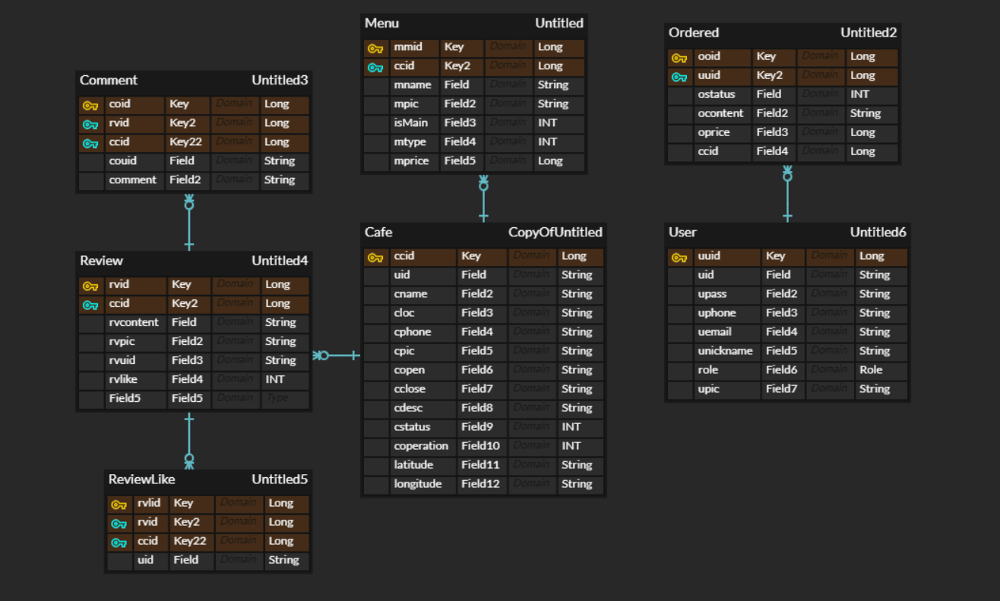
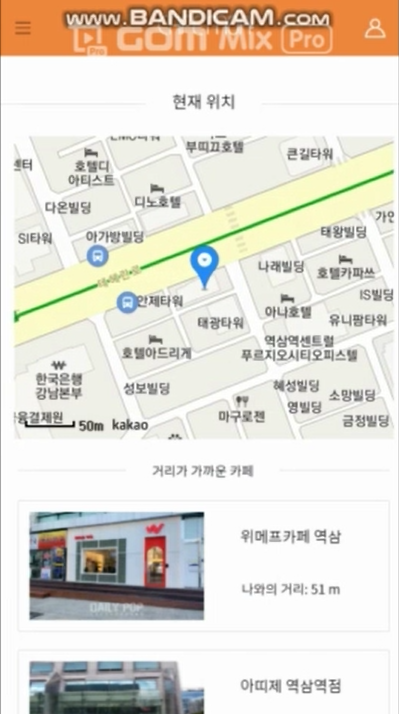
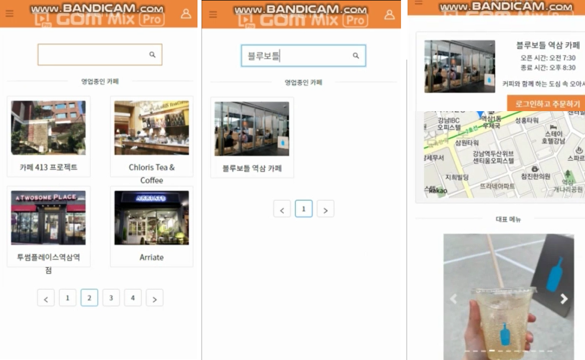
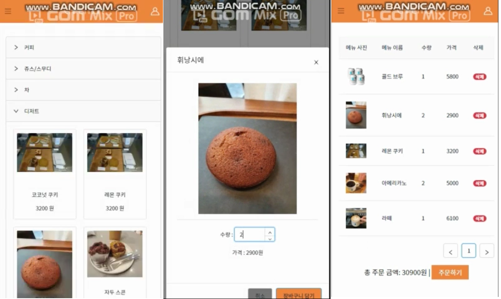
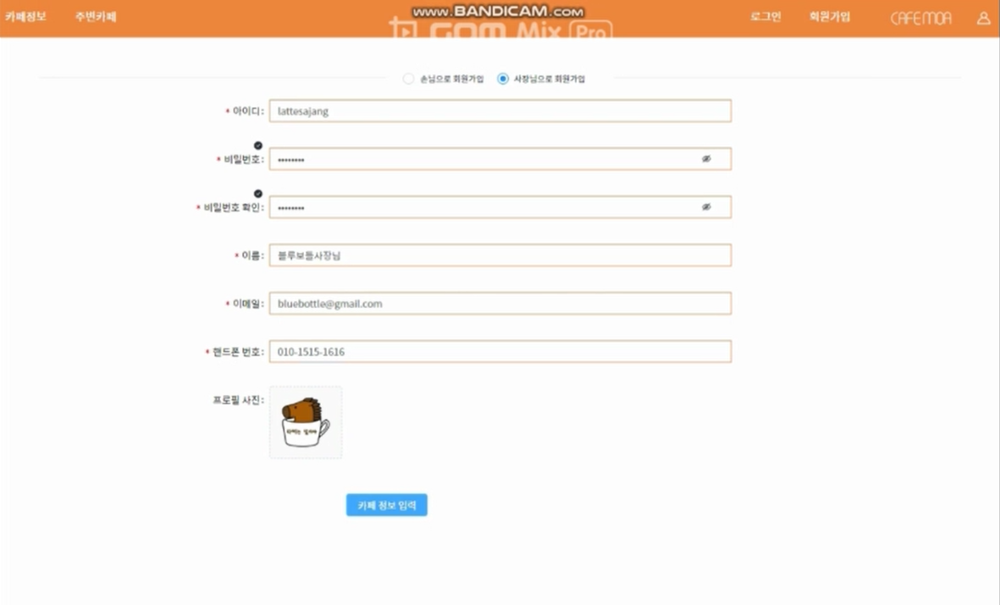
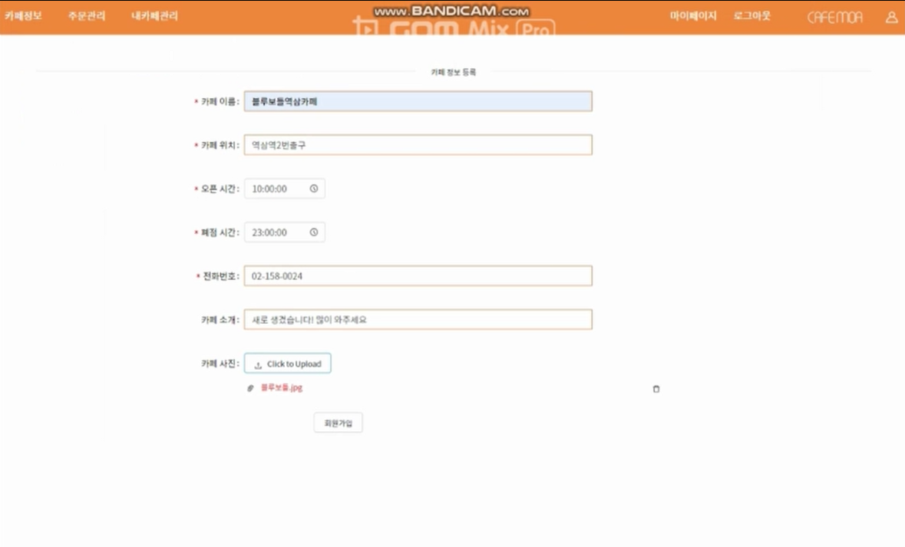
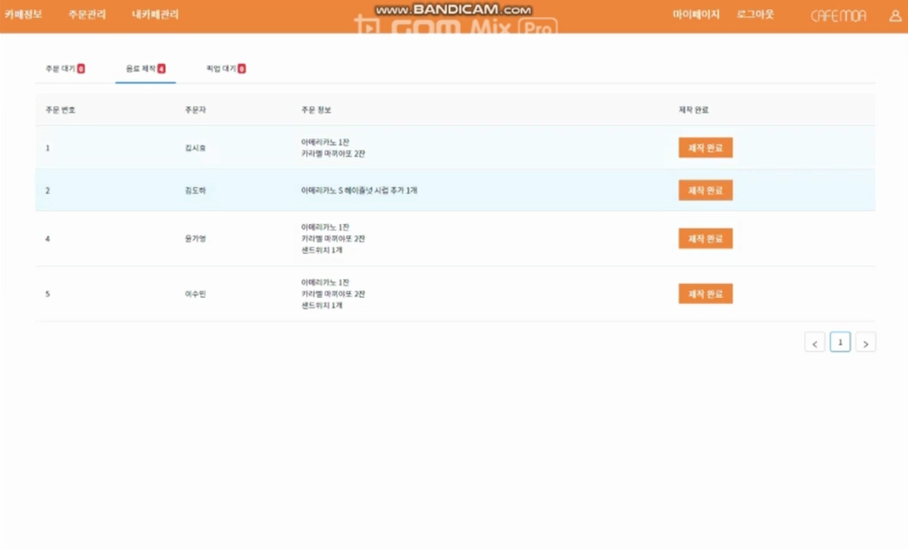

# CafeMoa

## 목차

1. [CafeMoa](#CafeMoa)

2. [기술 스택](#기술스택)

3. [데이터베이스 모델링(ERD)](#데이터베이스모델링(ERD))

4. [서비스 소개](#서비스 소개)
    
    

## :coffee:Cafe Moa

- 개인 카페 사장님들은 홍보 및 매출관리 , 고객에게는 주문 서비스를 제공하기 위한 서비스입니다.]
- 현재 위치를 기반으로 가까운 순으로 카페를 보여줍니다. 
   
   

## :computer:기술 스택

  
  
  
  
  
  
  
  
  
  
  
  
  
  

| Component         | Technology                 |
| ----------------- | -------------------------- |
| Frontend          | React                      |
| Backend           | Spring Boot 2.1+, Java 11+ |
| Database          | Maria Database             |
| Persistence       | JPA                        |
| API Documentation | Swagger-UI                 |
| Client Build      | npm, yarn                  |
| Server Build      | Gradle                     |

 
 

## :arrow_forward:데이터베이스 모델링(ERD)

 
 

## :star:서비스 소개

- **주변 카페 찾기**

- **카페 정보 제공 및 주문**

- **손님 / 사장님 회원가입 및 로그인**

- **사장님 주문 관리**

